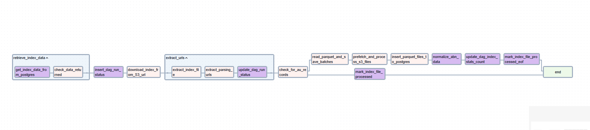
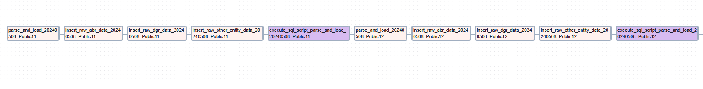

# ABN Mining Project

## Use-case
There were two main requirements given.
- Perform data mining on a common crawl dataset for Australian-based websites to pull out ABN numbers.
- Normalize and store the master ABN dataset provided by data.gov.au. 

## Exact requirement

Get access to common crawl data by going to the latest crawl: https://commoncrawl.org/.

- Find Australian company or organization websites. You should find at least 50,000, but there will be 100’s of thousands.
- Then load them into any database of your choice using a Spark pipeline. If the Spark setup is complicated, any other technology is also fine.
- I am expecting to see a few key data points about these companies that you can create around how you find them.
    1. Website
    2. Company name (where possible)
    3. Company industry (at least for a subset)
    4. ABN
Then, access ABN data from here: https://data.gov.au/dataset/ds-dga-5bd7fcab-e315-42cb-8daf-50b7efc2027e/details. This is the definitive source for businesses in Australia. Find additional information about the company from the ABN dataset and extend the company information database.

Your task is to clean, merge, and normalize these data sets as you see fit; we don’t want duplicates.

## Constraints

### Mining task
- Publicly available index URL(https://index.commoncrawl.org/) and its API does not allow pulling all the records for a given URL pattern, like suppose if we use *.au in the pattern we always get the same number of records (approx 1200).
	- Lack of Pagination support
	- Huge file Size even after compression (~ 7.304096 GB)
	- Working with raw files, issues with structure of file which lead to usage of regex pattern to pull out relevant *.au domain URLs
- Raw index file when uncompressed were again huge (~ 50 GB)
- Trying to minimize the task run time for mainly parsing the individual S3 key files from the main index file
- Setting up local PySpark to talk with airflow

### Gov dataset and Schema design
- Working with XML
- Lack of knowledge about internal statues like type of individual or nonindividual entity
- Huge XML files are resource intensive, forcing me to add limit to concurrency
- Duplicates in 20240515_Public10.xml (648 records)

## Approach

### Failed Attempt
The mining task was clearly calling out the usage of spark (PySpark) to help with all the problems associated with a big file and concurrent processing. But the local spark setup lacked the necessary resources to run the PySpark job from the local airflow setup inside docker.

### Sticking to Basics
I opted to work with a vanilla python implementation as I think with a bit of tweaking and chunking, we should be able to get the tasks to work inside airflow. I have sued PostgreSQL as the data store for the given project.

## Local Setup

### Docker
We have used Docker for running our local airflow ecosystem. In order to install dependencies we are using custom Dockerfile, here are the steps to get us up and running!
**Note:** I am using PostgreSQL from the local system for holding the project data while the airflow admin portal and other details are stored inside the docker's Postgres image!

**Step 1:**
Rename .env.sample file to .env for applying the environment variables to the docker instance. Let's maintain the schema name and table names as we have some .sql files which are using given table names (Possibility of some more refactoring here!)

**Step 2:**
Run the docker build command
`docker compose build`
If there are any changes to the .env file or requirements.txt then we might need to rebuild the image using the same command. We can use the --no-cache option with build for complete rebuild.

**Step 3:**
Once the container is built, we need to initial airflow database and required dependency using the command
`docker compose up airflow-init`
This is a one-time step, and we don't need to do this again!

**Step 4:**
`docker compose up`
We can use the -d option to run in the background!

### Postgres - Database
I was using local Postgres which was outside the docker host, this local Postgres installation can be accessed from the docker host using the host name - **host.docker.internal**.
Please feel free to create your user and associated password for the given project, keep it handy to be added to airflow admin for connecting airflow with the Postgres data store

The master file which has all the required SQL commands for the application to work smoothly is under [master_table_data_import_file.sql](docs/sql/master_table_data_import_file.sql). You can check the given file or look at the other files in the directory docs/sql to find the important schemas, tables and data required for the application as a prerequisite

For importing the given script, you can either use any psql client or use commands line psql
>psql -U username -d database_name
>\i path/to/your/file.sql
**Note:** path to sql file should be absolute

### Airflow Admin

- Create Connections (Admin -> Connections)
    - AWS
        >conn_id = aws_conn
        >type = aws
        Add Any functional aws secret and key! [Tutorial](https://www.youtube.com/watch?v=eElHCn4nDZw) for creating one, if you're not aware.
        
    - Postgres
        >conn_id = postgres_local
        >type = postgres
        You will need to add your database credentials here! If you're using local database from outside the docker container then your host name should be **host.docker.internal** and the default port is 5432!

- Create Pools (Admin -> Pools)
    - Create new pool with the name **limited_simultaneous_pool** with Slots value as 1
        >This pool is used inside ingest_au_gov_data DAG where-in we import data.gov.au ABN data from XML. The XML file were huge and hence the local resources were getting choked if more than 1 file was parsed concurrently!

### Data Pre-requisites
We need to have some default directories and data files presents in order for our application to run smoothly
- Parquet directory
	We need to have the directory named **parquet** inside the **data** folder, to have the path data/parquet
- Master ABN GOV dataset
	We need to dump all the files from the [data.gov.au - ABN](https://data.gov.au/dataset/ds-dga-5bd7fcab-e315-42cb-8daf-50b7efc2027e/details) mainly the part 1 and part 2 zip files. These files need to be extracted and added to the data directory under the directory name **abn_master_dataset**
	So the directory structure would look like:
	**data → abn_master_dataset → 20240508_Public11.xml**
- Duplicate records in 20240508_Public11.xml and 20240508_Public10.xml
	While running and examining the records of most of all the given files, there are around 648 records of ABN repeated with exactly the same structure and update date time so it's advisable to just delete them from the raw xml file. Since the execution happened as per the file name, I chose to remove the records from 20240508_Public10.xml file.
	The cleaned and deduplicated file is present in the [common_gov_records directory](docs/common_gov_records/20240515_Public10_deduplicated.xml), if interested please feel free to look at the code for check_common_records_gov_dataset.py for the underlying implementation in the same directory. Use **20240515_Public10_deduplicated.xml** from the directory. [duplicate_abn_public_10_xml.txt](docs/common_gov_records/duplicate_abn_public_10_xml.txt) holds the human-readable ABN's which were repeated

## DAG

### ABN Mining DAG (abn_mining.py - **ingest_cmoncrwl_abn_data**)

The idea is to pull and traverse/parse every **.au* domain available with common crawl website. The problem however was the response of https://index.commoncrawl.org/ API i.e, http://index.commoncrawl.org/CC-MAIN-2024-18-index?url=*.au, the given URL endpoint never lists all the data or even paginated data!
After a bit of research, I came across an S3 path which holds the list of indexes https://data.commoncrawl.org/cc-index/collections/CC-MAIN-2024-18/indexes/. We can use the AWS command line command like below to get the list of index files which have URLs.
`aws s3 ls https://data.commoncrawl.org/cc-index/collections/CC-MAIN-2024-18/indexes/` 
I checked first 4 indexes, but there was no trace of **.au** domains and in order to maintain the same list, we are using the table **ccrwl_index_2024_18** to maintain the indexes which are processed and which one to be processed next. Hence, we need a pre-filled index table for the 2024-18 crawl of the common crawl website.

The DAG looks like below:

Here are the steps
- Get the name of 1 index file from the **ccrwl_index_2024_18** table for processing
- Check if there is something to process from the given table
- Make an entry into **mining_dag_run_stats** table for the given index
- Download the given zipped index file into /data directory
	- The path looks like **/opt/airflow/data/cdx-00004.gz/airflow_tmp_dir_aadabeb4/cdx-00004.gz**
	- The directory and related files are created automatically
- Unzip the given file
- Create parquet file with the extracted data for *.au domains and other metadata like offset, length and filename
	- This file is small compared to the overall file as the records are filtered to have only *.au/, *.au/contact**, *.au/privacy**, *.au/about**
	- We remove exact duplicate URLs here
	- The path of the given file is **/opt/airflow/data/parquet/{cdx-00004}**
- Update **mining_dag_run_stats** table with the numbers obtained for total_records, filtered_au_records
- We use branch operator here, to check if there are *.au* records present in the given index and mark the index file as processed into **ccrwl_index_2024_18** table
- The cdx-00004 had around 174k records for au domain, this can be more or less compared and hence I decided to chunk the main file into batches of 1000 records for easier process as we had to download the warc file associated to each record in the file
- Created a dynamic task to process each record inside each of the batch file created
	- Pre-fetched the associated warc file in the batch of 250 files and performed processing of downloaded files
	- This process takes time but since we use async to download the file, the download is much quicker compared to my previous versions
	- After download, we run regex to fetch ABN, industries and entity name from the downloaded content of each warc file
	- We have used the pre-defined list of Australian industries and company suffixes to try and fetch relevant data.
	- Although we got ABN, industry with good certainty but the entity name was difficult to scrape from the website content.
	- We create batch files of the processed data with the above logic
- We then insert all the processed parquet files to **mining_abn_data_raw** table
- We execute Postgres script
	- Insert unique ABN numbers data into **abn_mining_data**
	- Associate industry with **australian_industries** table and store it inside **abn_mining_industry_mapping** table
- Update relevant counts inside **mining_dag_run_stats** table
- marked the index file as processed inside **ccrwl_index_2024_18** table

---

### Ingest data.gov.au ABN Data (ingest_abn_gov_dataset.py - ingest_au_gov_data)

So as a prerequisite please look into the Data Prerequisites steps mentioned above to avoid dealing with duplicates, although the duplicate record file is the last one named as **20240508_Public10.xml**.
The main requirement was to design the schema and also associate records from the given XML file. The structure of the XML file is mentioned in the [attached document](docs/abnlookupbulkextractreadme.pdf). There are still some unknowns about the data dictionary like the <Individual type="XX"></Individual> and <Nonindividual type="XX"></Nonindividual> elements type attribute. Although, I have saved the given attribute but had no clue about its significance. I will upload the associated table ERD soon but here is the rough image of the created dag to upload the data.gov.au data to our database.

The DAG looks like below:

The DAG is straightforward where-in we parse the given XML file and store respective data into tables inside raw schema and later normalize and store the same into **mds** schema.

We mainly loop over all the files present in the **data/abn_master_dataset** to search for all .xml files, while looping we follow the following steps:
- We process each file
	- Since the size of the XML file was huge we used lxml's etree.iterparse and constantly freed up the memory load.
	- We parse main abn_data, dgr_data and other_entity_data available with each XML record
	- We create parquet file for each of the given data sets inside the **parsed** directory of **data/abn_master_dataset** directory
- Insert abn_data into **raw.abn_bulk_data** table
- Insert dgr_data into **raw.abn_dgr_bulk_data** table
- Insert other_entity_data into **raw.abn_other_entity_bulk_data** table
- Normalizing and importing all the above tables into equivalent tables into **mds** schema for the given index file
	- Move ABN related data from **raw.abn_bulk_data** to **mds.abn_data**
	- Move User/Entity based data from **raw.abn_bulk_data** to **mds.entity_master**
	- Associate **mds.entity_master** with **mds.abn_data** based on ABN number and as a foreign key into **mds.abn_data** table
	- Move DGR data from **raw.abn_dgr_bulk_data** to **mds.abn_dgr**
	- Move Other Entity Data from **raw.abn_other_entity_bulk_data** to **mds.abn_other_entity**

---